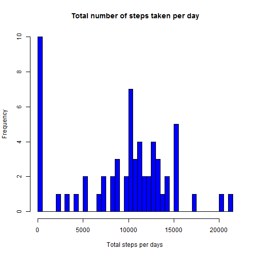
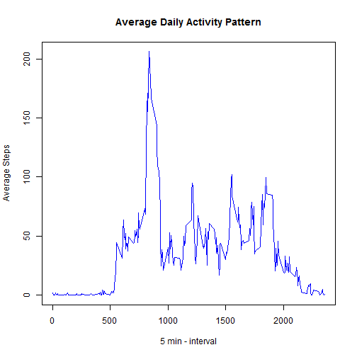
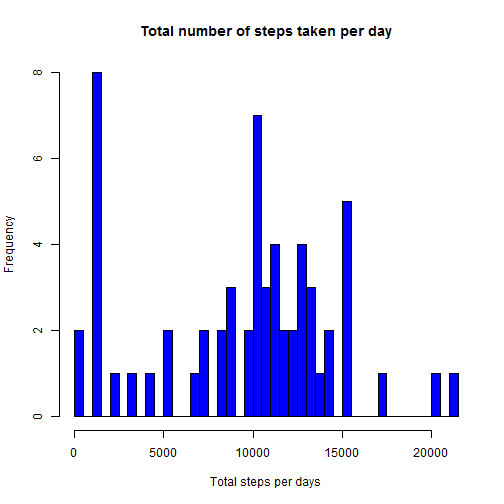
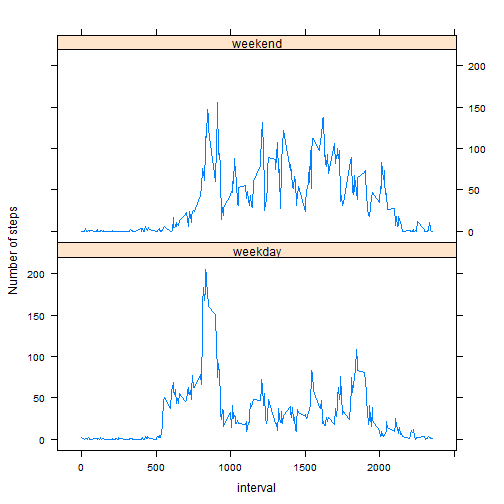

```r
library(dplyr)
library(lubridate)
library(lattice)
```

# Loading and preprocessing the data

## Read the data
Before running this code, make shure you have the zip file named **"activity.zip"** containing the data 
in current repository

```r
data<-read.csv(unz("activity.zip","activity.csv"))
```

## Process/transform
First thing first, let's take a look to the overview of the data and correct the date format


```r
data$date<-as.Date(data$date,format="%Y-%m-%d")
str(data)
```

```
## 'data.frame':	17568 obs. of  3 variables:
##  $ steps   : int  NA NA NA NA NA NA NA NA NA NA ...
##  $ date    : Date, format: "2012-10-01" "2012-10-01" ...
##  $ interval: int  0 5 10 15 20 25 30 35 40 45 ...
```


# What is mean total number of steps taken per day?


## Calculation
Here we calculate the total number of steps taken per day **without missing values** with the dplyr library


```r
test<-data%>%group_by(date)%>%summarise(total_per_day=sum(steps,na.rm=TRUE))
```

## Histogram
Plot an histogram of the total number of steps taken per day. 

```r
hist(test$total_per_day,main="Total number of steps taken per day",xlab="Total steps per days",breaks=40,col="blue")
```


 
*Note:*  
*1. As there is a lot of data, we set the break option to 40.*  
*2. The __Total__ is plot and not the days.*

## Mean and median

Now we want to know the mean and median of the total number of steps taken per day.
As there is no more missing value, we can do the calculation.

```r
mean1<-mean(test$total_per_day)
median1<-median(test$total_per_day)
```

 The current __mean__ is 9354.2295082 and the __median__ is 10395.

# What is the average daily activity pattern

## Plot of the time serie

First, we calculate the average number of steps taken by 5-minute interval across all days, then we plot the time series.

```r
test2 <- data %>%
        group_by(interval) %>%
        summarise(StepsInterval=mean(steps,na.rm=TRUE))

with( test2, plot(interval,StepsInterval,
                    type="l",
                    col="blue",
                    main="Average Daily Activity Pattern",
                    xlab="5 min - interval",
                    ylab="Average Steps")
)
```



## Maximum number of Steps
From the previous tarnsformation we calculte the max!


```r
max<-with(test2,interval[which.max(StepsInterval)])
```

The __maximum number of setps__ is 835

# Imputing Missing Value

## Calculation

We calculte the total number of missing values int the dataset, *i.e* any line with a missing value across all the column.


```r
c1<-nrow((filter(data,is.na(steps) | is.na(date) |is.na(interval))))
```

the number of lines withat least one missing value is 2304.

## Strategy for missing values

As the stategy does not need to be sophisticated, we decide to fill the missing values that only exist in the "Steps"
column by replacing them with the median of the steps for the interval.

## Create a new dataset with the missing data filled


```r
aa<-tapply(data$steps,as.factor(data$interval),median,na.rm=TRUE)
bb<-unique(data$interval)
median<-cbind(as.data.frame(aa),as.data.frame(bb))
names(median)<-c("med","interval")
newdata<-merge(data,median,by=("interval"))
newdata<-newdata %>% mutate(steps=ifelse(is.na(steps),med,steps))%>%select(-med) 
```
We verifie that the new dataset as the same length and wide than the old one!


```r
str(newdata)
```

```
## 'data.frame':	17568 obs. of  3 variables:
##  $ interval: int  0 0 0 0 0 0 0 0 0 0 ...
##  $ steps   : int  0 0 0 0 0 0 0 0 0 0 ...
##  $ date    : Date, format: "2012-10-01" "2012-11-23" ...
```

## Histogram of total number with missing vl=alues filled


```r
fig<-newdata%>%group_by(date)%>%summarise(total_per_day=sum(steps,na.rm=TRUE))
hist(fig$total_per_day,main="Total number of steps taken per day",xlab="Total steps per days",breaks=40,col="blue")
```




# Are there difference in activity pattern between weekday and weekends?

## Create a new factor variable

Here we will use the library lubridate to create a new factor variable


```r
final<-newdata %>% 
        mutate(day=as.factor(ifelse(wday(date) %in% c(1,7),"weekend","weekday")))
```

## Make a panel containing time series


```r
final<- final %>% 
        group_by(day,interval) %>%
        summarise(meansteps=mean(steps,na.rm=TRUE))
with (final, 
      xyplot(meansteps ~ interval|day, type="l", 
             ylab="Number of steps",layout=c(1,2)))
```



There is more steps during weekend than during week!
